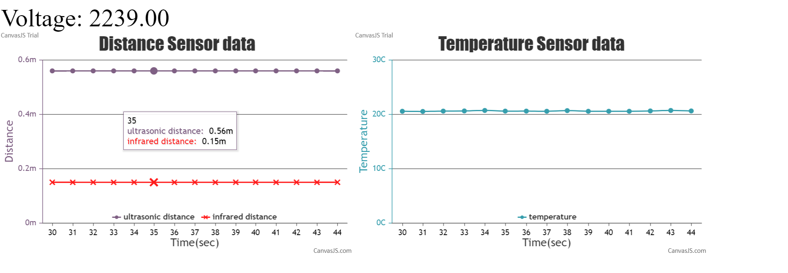

# Tactile Internet
Authors: Carmen Hurtado, Samuel Sze

Date: 2021-03-05
-----

## Summary
**Contributors:**
Samuel | Carmen 
-------|--------
 | ) 

In this quest we are asked to read analog signals from 3 different sensors and to display the results in an organized and readable way. For this we wired up a Thermistor, Ultrsonic sensor, and IR sensor to the ESPR32 board. The sensors are each connected to their own analog input pin where we read in voltage and convert it to engineering units (Celsius for the Thermistor and Meters for the two distance sensors). Following that, using node.js and CanvasJS, we created a web server to display data from the ESP32 serial port in real time updating every 1 second. These are also returned back to the user in the console in real time every 1 second and saved to a csv file. 

### Investigative question: 
Measurements taken by us.

**Test data: Ultrasonic**
| Actual distance |Measured distance |
|---------------------------------------------|:-----------:|
|106cm | 112cm|  
|93cm | 100cm| 
|79cm | 87cmcm|   
|309cm | 270cm|  

**Test data: IR**
| Actual distance |Measured distance |
|---------------------------------------------|:-----------:|
|63cm | 58cm|  
|49cm | 45cm| 
|30cm | 28cmcm|   
|100cm | 86cm| 
|135cm | 108cm|  

From these results, we get a brief idea of the accuracy of our sensors. The IR sensor tends to be more accurate overall whithin its range. For this we think that this sensor would perform better if used in a robotic car. 

Some other considerations include:
1. Environment: IR sensors are sensitive to other type of light sources. Ultrasonic sensors might not function in areas where there are other ultrasonic frequencies around (interference).
2. Target material: Accuracy of ultrasonic sensors depend on the acoustic impedence between the travelling medium and the target material. If the target material has acoustic impedence matching that of the travelling medium, the sensor might not detect the distance very well. 

## Self-Assessment
### Objective Criteria

| Objective Criterion | Rating | Max Value  | 
|---------------------------------------------|:-----------:|:---------:|
| Objective One | 1 |  1     | 
| Objective Two | 1 |  1     | 
| Objective Three | 1|  1     | 
| Objective Four | 1 |  1     | 
| Objective Five | 1 |  1     | 
| Objective Six | 1 |  1     | 
| Objective Seven | 1 |  1     | 

### Qualitative Criteria

| Qualitative Criterion | Rating | Max Value  | 
|---------------------------------------------|:-----------:|:---------:|
| Quality of solution | 5 |  5     | 
| Quality of report.md including use of graphics | 3 |  3     | 
| Quality of code reporting | 3 |  3     | 
| Quality of video presentation | 3 |  3     | 

## Solution Design
We have 3 different sensors:
- Thermistor: Output voltage needs to go through a voltage divider. Sampled 50 times a second. Converted into temperature using beta value and resistance over thermistor. 
- Ultrasonic Range Finder: Output voltage goes directly into analog pin, needs a 100uF capacitor to resolve noise; sampled 10 times a second. Converted into distance using data sheet conversion specifications from MaxBotics. Specs: Range (30cm - 450cm)
- IR: Output voltage goes directly into analog pin; needs a 100uF capacitor to resolve noise; sampled 50 times in a second. Converted into distance using data sheet graph provided by SharpIR. Specs: Range(20cm - 150cm)

We have 3 different analog pins to connect each sensor and read in an output voltage in mv. This voltage is then converted to engineering units. The equations are different for each sensor. Thermistor retuns temperatur in Celsius, Both distance sensors return values in meters.

Overall architecture:
1. Data is read through the ESP32 pins and controlled via sensor.c. 
2. Node.js program (index.js) reads in the data using the serialport module and builds a web server using socket.io to display data in current time at intervals of 1 second. It also prints data to the console terminal and saves the data into a csv file in real-time.
3. In the web server (index.html) the data is displayed in two charts. One chart shows the distance vs time values from both the IR and Ultrasonic; the second chart displays the temperature vs time. To compare the results with the output voltage read, we show in the top left corner the changing output values.

## Sketches and Photos

## Supporting Artifacts
- [Link to video demo]()
- [Link to .c code file](https://github.com/BU-EC444/TeamRocket-Sze-Hurtado/blob/master/quest-2/code/sensor.c)
- [Link to .js code file](https://github.com/BU-EC444/TeamRocket-Sze-Hurtado/blob/master/quest-2/code/index.js)
- [Link to .html code file](https://github.com/BU-EC444/TeamRocket-Sze-Hurtado/blob/master/quest-2/code/index.html)

## Modules, Tools, Source Used Including Attribution
- ADC
- Thermistor
- Ultrasonic range finder
- IR range finder
- node.js
- CanvasJS 

## References
- [Ultrasonic sensor spec sheet](https://www.maxbotix.com/documents/HRLV-MaxSonar-EZ_Datasheet.pdf)
- [IR sensor spec sheet](https://www.sparkfun.com/datasheets/Sensors/Infrared/gp2y0a02yk_e.pdf)
- [Thermistor sensor spec sheet](https://www.eaa.net.au/PDF/Hitech/MF52type.pdf)
-----

