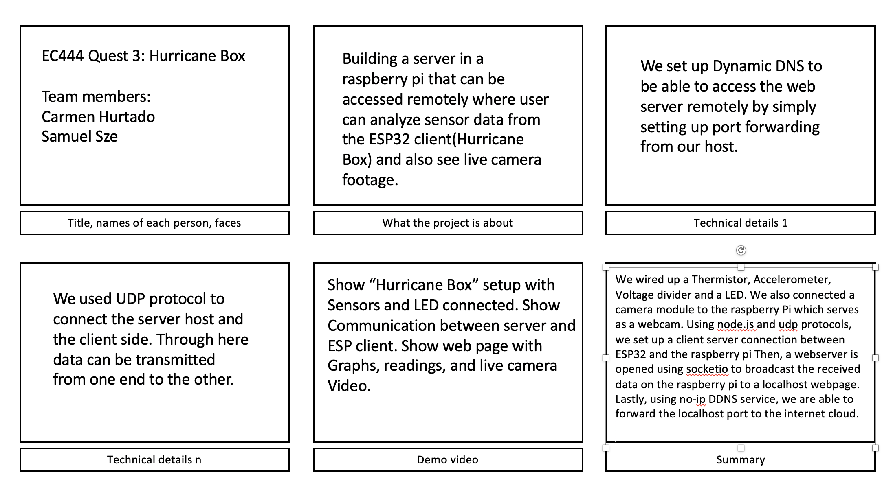
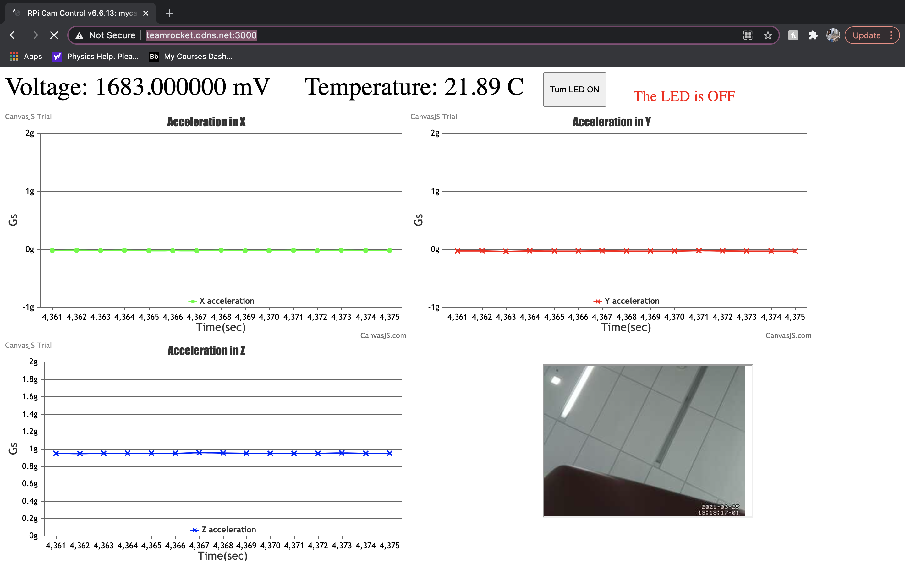

# Hurricane Box
Authors: Carmen Hurtado, Samuel Sze

Date: 2021-03-25

-----

## Summary
**Contributors:**
Samuel | Carmen 
-------|--------
 | ) 

In this quest we are asked to read analog signals from various different sensors and to display the formatted results on a webpage that can be accessed remotely anywhere in the World. 

For this we wired up a Thermistor, Accelerometer, Voltage divider and a LED to the ESPR32 board. The thermister and voltage divider are connected to their own adc analog GPIO where we read in the voltage and convert it to engineering units (Celsius for the thermistor and millivolts for the voltage divider). The accelerometer is setup using the i2c connection (SDA, SLA), similar to alphanumeric display. The LED is setup as a LEDc peripheral using PWM signals to control its intensity. We also connected a camera module to the raspberry Pi which serves as a webcam. 

Following that, using node.js and udp protocols, we set up a client server connection between ESP32 and the raspberry pi where the ESP32 (client) relays sensory data to the raspberry pi (server) at fixed intervals of 1 second with a timeout function to garantee transmission. Then, a webserver is opened using socketio to broadcast the received data on the raspberry pi to a localhost webpage. Lastly, using no-ip DDNS service, we are able to forward the localhost port to the internet cloud.

### Investigative question: 
What are the steps we take to make our device and system low power?
After some reserach we reached this paper ([A Case for Ultra Low-power Web Servers](http://none.cs.umass.edu/papers/pdf/IGCC14-greening.pdf)) on implemeting what is refered to as Green Website Hosting to reduce the power consumption of low volume web platforms. This implementation uses renewable energy sources to power the web servers or to counterbalance the energy used by the servers. 
To make our device low power, in this case the ESP32, we can set a sleep mode to be triggered if the data ceases to change. For example we can have our device only be active during "Hurricane season" or make it more dynamic to have the capability to come out of the sleep mode if ot senses a change in the data reading. More on Sleep Mode implementation here [Sleep Mode source](https://circuitdigest.com/article/implementing-low-power-consumption-in-microcontrollers)

## Self-Assessment

### Objective Criteria

| Objective Criterion | Rating | Max Value  | 
|---------------------------------------------|:-----------:|:---------:|
| Objective One | 1 |  1     | 
| Objective Two | 1 |  1     | 
| Objective Three | 1|  1     | 
| Objective Four | 1 |  1     | 
| Objective Five | 1 |  1     | 
| Objective Six | 1 |  1     | 
| Objective Seven | 1 |  1     | 

### Qualitative Criteria

| Qualitative Criterion | Rating | Max Value  | 
|---------------------------------------------|:-----------:|:---------:|
| Quality of solution | 5 |  5     | 
| Quality of report.md including use of graphics | 3 |  3     | 
| Quality of code reporting | 3 |  3     | 
| Quality of video presentation | 3 |  3     | 

## Solution Design
Sensors:
- Thermistor: Output voltage needs to go through a voltage divider. Sampled 10 times a second. Converted into temperature using beta value and resistance over thermistor. 
- Voltage divider: Output voltage is converted from adc reading. Sampled 10 times a second. Expected output voltage of 1/2 of 3.3V (fullscale voltage delivered by ESP32).
- ADXL343 accelerometer: uses i2C communication which creates a master-slave connection between ESP32 and the accelerometer. The master (ESP32) reads a 16bit register from the slave at fixed intervals and uses appropriate conversions to convert the 2 byte data into a float. 
- LED: uses PWM signal to control the brightness of the LED pin. This is achieved by controlling the duty cycle at a fixed voltage. 
- Pi camera module: uses motion to activate the attached camera on the Pi to serve as a webcam. 

Local Area Network Architecture (Backend)
1. Data is read through the ESP32 pins and controlled via udp_client.c
2. udp_client.c also connects to the loan router WIFI setup under Linksys/Tomato. 
3. Once WIFI is connected, ESP32 sets up a udp client socket and continously send data to the IP address of the Raspberry Pi at fixed intervals of 1second. It then waits for an acknowledgement from the Pi, before sending its next sensory reading packet. If an acknowledgement is not received, the udp client waits for 5 seconds before automatically sending its next packet in queue to the udp server. 
4. At the same time, node.js program (demo_udp.js) sets up a udp server in the raspberry Pi. The server remains open for the entire duration and listens in on the Pi's ip address's port 3333. Once it receives a client message from ESP32, it will push the data packet into the front end. 

Front End webpage
1. demo_udp.js also sets up a webserver on the PI at port 3334. The webserver receives the client message in the same script and uses socketio to broadcast canvasjs chart options to the index.html webpage at intervals of 1second. 
3. In the web server (index.html), the data is displayed in 6 different locations. The voltage and tempearture are displayed as boxes. The three acceleration data are displayed by graphs. The Pi camera is embedded into the webpage. The LED control is setup as a clickable button and a descriptive caption to indicate the on/off status of LED. 
3. Port forwarding is done by no-ip DDNS service, forwarding the webserver from Local area network to the internet cloud. The connection is http://teamrocket.ddns.net:3000.

## Sketches and Photos

## Supporting Artifacts
- [Link to video demo](https://youtu.be/VHqB5IZUhHE)
- [Link to .c code file](https://github.com/BU-EC444/TeamRocket-Sze-Hurtado/blob/master/quest-3/code/udp_client.c)
- [Link to .js code file](https://github.com/BU-EC444/TeamRocket-Sze-Hurtado/blob/master/quest-3/code/demo_udp.js)
- [Link to .html code file](https://github.com/BU-EC444/TeamRocket-Sze-Hurtado/blob/master/quest-3/code/index.html)

## Modules, Tools, Source Used Including Attribution
- ESP32
- Raspberry Pi Zero W 
- Raspberry Pi Zero W Camera
- ADC
- Thermistor
- Accelelometer
- i2c
- UDP Protocol
- DDNS
- PWM
- node.js (socket.io, express, datagram)
- CanvasJS 

## References
- [UDP client expressif](https://github.com/espressif/esp-idf/tree/master/examples/protocols/sockets/udp_client)
- [ADXL343 specfications](http://whizzer.bu.edu/skills/accel)
- [Thermistor sensor spec sheet](https://www.eaa.net.au/PDF/Hitech/MF52type.pdf)
- [DDNS](http://whizzer.bu.edu/skills/dyndns-pi)
- [WIFI on ESP](http://whizzer.bu.edu/skills/wifi)
-----

