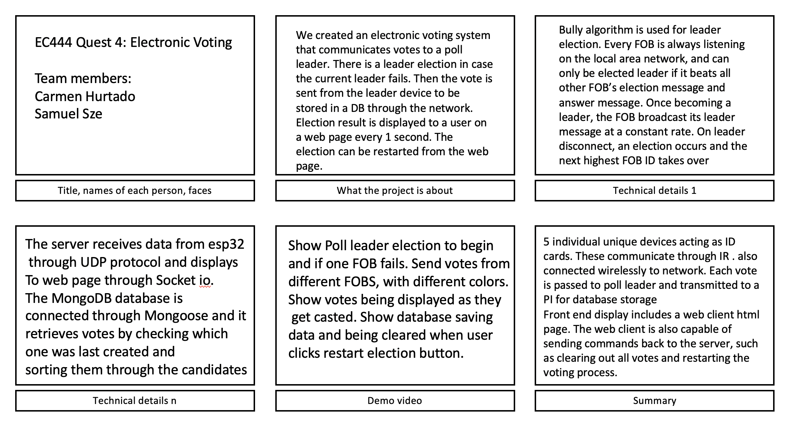
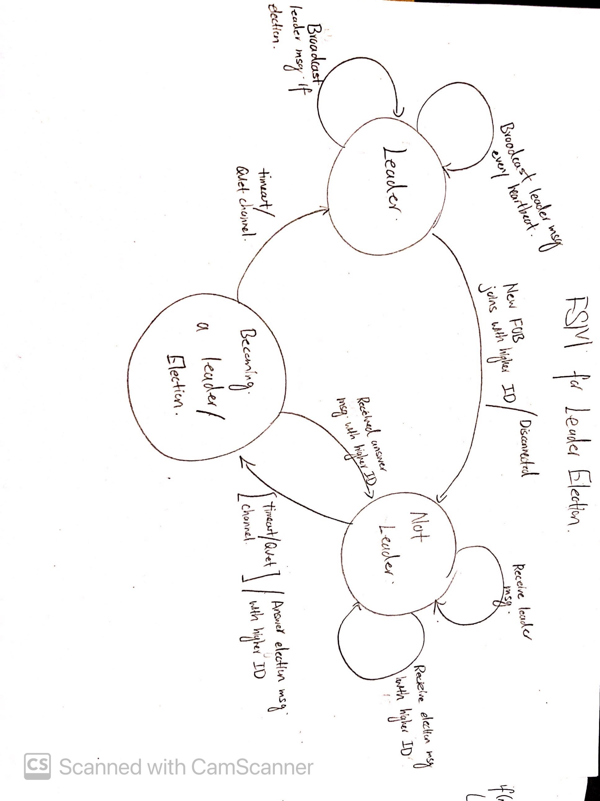

# Electronic Voting
Authors: Carmen Hurtado, Samuel Sze

Date: 2021-04-08

-----

## Summary
**Contributors:**
Samuel | Carmen 
-------|--------
 | ) 

In this quest we are designing an electronic voting system. To do so, we created 5 invdividual unique devices (FOBS) acting as ID cards. These ID cards are able to communicate to one another through secured near field IR communications. They are also connected wirelessly to the local area network. Whenever a FOB votes, the vote is passed onto an elected poll leader FOB and subsequently transmitted to a Raspberry PI for database storage and front end display. 

Front end display includes a web client html page. The web client is also capable of sending commands back to the server, such as clearing out all votes and restarting the voting process.

### Investigative question: 
Investigative Question: 
In our electronic voting system, the most sensitive component is the voting data. Therefore, ideally the transfer of this data has to be completely secure from any hacker attacks. If the votes get altered in any way it would constitute a huge issue. Most of the possible attacks to our system can in some way or another change the data. However, there are ways to increase security to a system like this.
Possible attacks to our system and how to counteratack them:
- Man-in-the-middle (MitM) attack. Here a hacker can interfere in the connection and listen to the "conversation" between endpoints. We shoudl implement a strong encryption mechanism, and strong credentials for our router to prevent the hacker from rerouting our DNS server to their own. 
- Denial of Service to the webpage, network, or the FOBS. The components could stop working properly or at all by overwhelming the requests. To prevent some of this type of attacks, we would have to increase the size of the connection queue and decrease the timeout on open connections.
- Drive-by Attacks. Hackers look for insecure websites and spread malware. This could install malware on the computer and make other compents fail or make the system more prone to other attacks. To avoid this, we need to keep browsers and operating systems up to date to protect the device. 
- Password attacks. Our databse is password protected and could be attacked and hacked to change vote data. To further protect our database, we would need to implement an account lockout policy that will lock the account after a few invalid password attempts. 
- Cross-site scripting (XSS) attack. Here, our main web page can be completely altered with wrong information and any user interactions with it can cause other types of attacks. To prevent from this, we would have to make sure all data is validated an filtered before echoing anything back to the user in the web page.

[Investigative source used](https://blog.netwrix.com/2018/05/15/top-10-most-common-types-of-cyber-attacks/)

## Self-Assessment

### Objective Criteria

| Objective Criterion | Rating | Max Value  | 
|---------------------------------------------|:-----------:|:---------:|
| Objective One: FOB performs IR NFC data exhcnage to another FOB with LED indication | 1 |  1     | 
| Objective Two: Receiving FOB communicates vote to Poll leader (LED indication) via network communication | 1 |  1     | 
| Objective Three: Poll leader (LED indication) is replaced if fails  | 1|  1     | 
| Objective Four: Poll leader reports votes to server database | 1 |  1     | 
| Objective Five: Portal allows query to databse to show actual vote counts per candidate | 1 |  1     | 
| Objective Six: Operates over multiple sites or with all available fobs | 1 |  1     | 
| Objective Seven: Investigative question response | 1 |  1     | 

### Qualitative Criteria

| Qualitative Criterion | Rating | Max Value  | 
|---------------------------------------------|:-----------:|:---------:|
| Quality of solution | 5 |  5     | 
| Quality of report.md including use of graphics | 3 |  3     | 
| Quality of code reporting | 3 |  3     | 
| Quality of video presentation | 3 |  3     | 

## Solution Design

### FOB circuitry:

FOB circuitry includes an ESP32, a L293 H-bridge, two push-buttons, three LEDs, an IR transmitter and an IR receiver. Detail circuitry is shown in the figure below.  

To change a voting color, the push-button corresponding can be depressed. To send a message, the other push-button can be depressed. The current FOB voting message will only be received by another receiving FOB if the convex side of the IR receiver is facing towards the IR transmitter. Once a message is received, a corresponding LED on the received FOB will light up indicating the voting color of the received FOB message. 

### Leader Election:

Leader election plays a big role in determining how the FOB transmits voting messages to the PI server. There is at any moment only one leader within the group of connected FOBs, while all the other FOBs should keep quiet during that moment. Leader election occurs when the channel is quiet for over a leader heartbeat (2s) amount of time, in which several outcomes will occur. The Finite State Machine of this leader election is shown below to better illustrate the corresponding events and states. 

### Local Area Network Architecture (Backend):

UDP multicast is the main networking administration structure used to connect multiple FOBs and the Raspberry PI server together. Essentially, a multicast address is opened within a local area network setup by a loan router. Within the multicast address, leader elections and UDP voting messages are broadcasted by each FOB when needed, and picked up by the relevant FOBs or PI server by using string matching. 

### Database and Front-end webpage:
The databse used for our system is MongoDB with Atlas Cloud Databse Interface. We decided to implement this because it provides a easily accessible and password protected database that can interact with a Node JS program. 
The Atlas Cloud Database Interface lets the Administrator create a cluster to store multiple databases while also making them password protected and only accesible by whitelisted IP addresses and specified user with credentials. 
We created what is called a collection inside our database with a Mongoose Schema that specifies the attributes of each object (vote) of the collection. In essence, each vote data will have a "Vote" attribute (R,G,Y) and a "FobID" attribute (1,2,3,...). Lastly, the Schema automatically creates a timestamp for each object that is saved. With this timestamp we are able to access the most recent data as it gets saved in the database and we display it in the web server accordingly. 
Our web server is organized with three columns to display the data for each election candidate in a list manner. Each vote is presented with its timestamp and Fob Id where the vote was casted. On top of each column there is a tally of the total votes that the candiates received which updates as new votes come in. Lastly, the user also has the functionality to start a new election by clicking a button. This action clears the database and starts a new voting query. 
To constantly update the information shown to the user in the web page, we used socket io to communicate the data from client to server. 

## Sketches and Photos

## Supporting Artifacts
- [Link to video demo](https://youtu.be/9RcBN8nKxJE)
- [Link to .c code file](https://github.com/BU-EC444/TeamRocket-Sze-Hurtado/blob/master/quest-3/code/udp_client.c)
- [Link to .js code file](https://github.com/BU-EC444/TeamRocket-Sze-Hurtado/blob/master/quest-3/code/demo_udp.js)
- [Link to .html code file](https://github.com/BU-EC444/TeamRocket-Sze-Hurtado/blob/master/quest-3/code/index.html)

## Modules, Tools, Source Used Including Attribution
- ESP32
- Raspberry Pi Zero W 
- RMT and UART for NFC IR
- UDP Protocol (Multicast)
- MongoDB, Mongoose, and Atlas Cloud DB
- node.js (socket.io, express, datagram)

## References
- [UDP client expressif](https://github.com/espressif/esp-idf/tree/master/examples/protocols/sockets/udp_client)
- [WIFI on ESP](http://whizzer.bu.edu/skills/wifi)
-----

